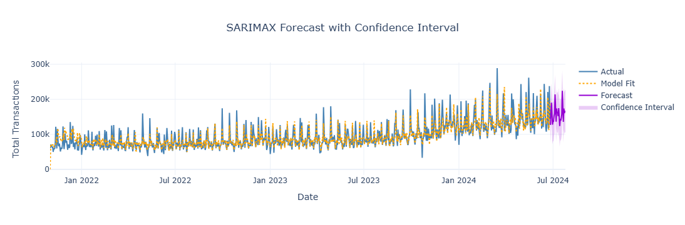

# Sales Forecasting Using SARIMAX

This project applies SARIMAX (Seasonal AutoRegressive Integrated Moving Average with eXogenous regressors) to forecast future sales based on historical time series data.

## 📊 Overview

Time series analysis is a powerful tool for forecasting, and SARIMAX extends ARIMA by handling seasonality and external factors. This project uses historical sales data to build a predictive model.

## 🛠️ Techniques Used

- **Autocorrelation and Partial Autocorrelation analysis (ACF & PACF)**  
  Identified significant lags in the time series data to guide SARIMAX parameter selection.

- **Stationarity testing using Augmented Dickey-Fuller (ADF) test**  
  Checked whether the time series is stationary, and applied differencing where necessary.

- **SARIMAX modeling using `statsmodels`**  
  Implemented a Seasonal ARIMA model that accounts for both seasonal and non-seasonal trends.

- **Train-test split for time series validation**  
  Divided the dataset chronologically to evaluate model performance on future unseen data.

- **Forecast evaluation using error metrics (e.g., MAE, RMSE)**  
  Assessed prediction accuracy using standard regression error metrics.


## 🔍 Results

The forecast indicates continued seasonal behavior and an upward trend in transactions. Confidence intervals widen into the future, reflecting increasing uncertainty in long-term predictions.



## 📦 Requirements

- pandas
- numpy
- matplotlib
- statsmodels
- seaborn (optional)

Install with:

```bash
pip install -r requirements.txt


